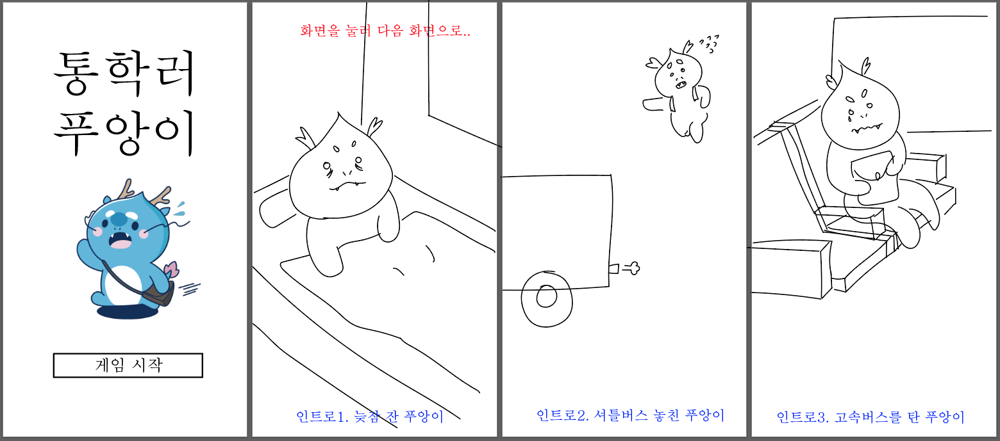
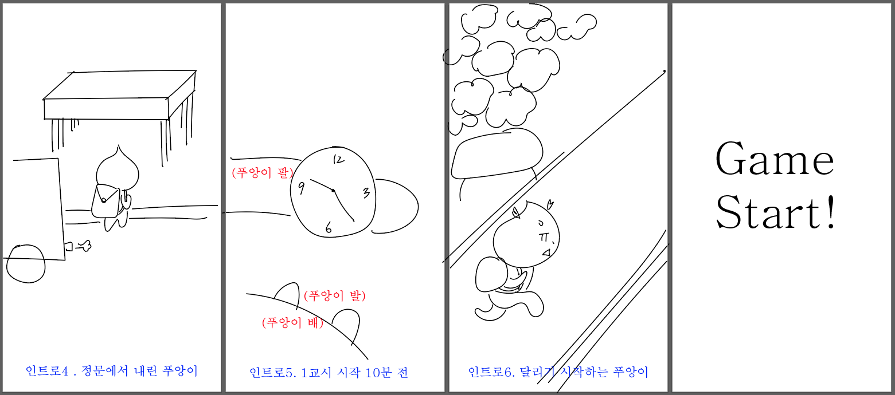
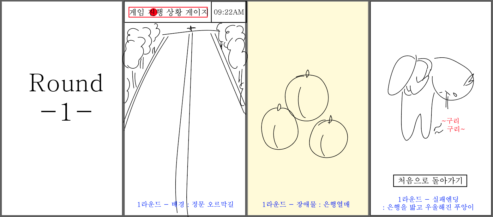
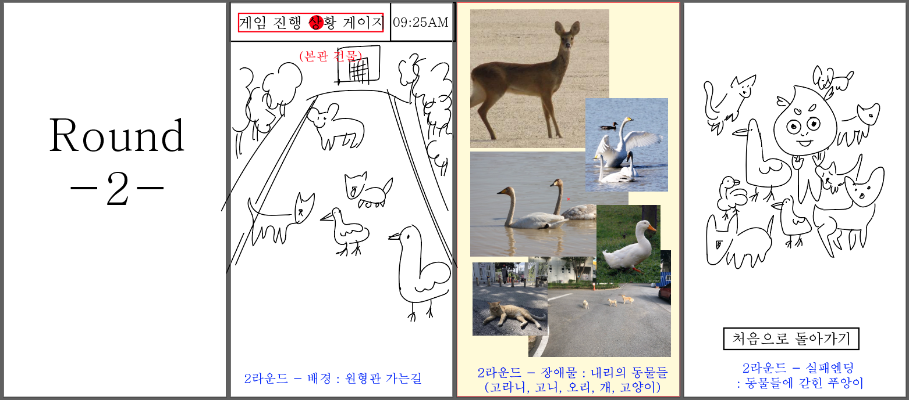
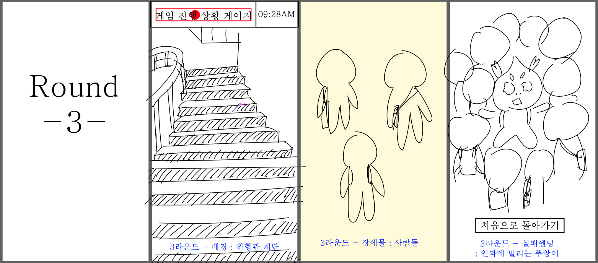

# T04
커밋 1000번 찍읍시다!

## 기능 목록
- 화면모드 전환
  : (1)시작화면, (2)인트로, (3)*3 라운드 1~3(각각 시작화면, 게임 실행, 게임 실패 엔딩), (4)아웃트로, (5)크레딧 -> 총 13개의 화면모드
  - 시작화면 메뉴 : <게임시작>, <크레딧> 2가지 버튼 클릭시 해당 화면 모드로 전환되기
  - 인트로, 아웃트로에서 화면 클릭/키보드 입력시 다음 장면으로 넘어가기
  - 각 라운드 실패 엔딩 화면 : <게임 다시 하기>, <처음으로 돌아가기> 2가지 버튼 클릭시 해당 화면 모드로 전환되기
  - 크레딧 화면 : <처음으로 돌아가기> 버튼 구현
  - 인트로 건너뛰기 버튼.. 제작할 수도 있음

- 게임 실행 화면 상단
  - 게임 진행 상황 게이지와 게임 내의 시계 구현을 위한 time()세팅
  - 게임 진행 정도에 따라서 게임 실행 화면 상단에서 도형 이동
  - 게임 진행 정도에 따라서 게임 실행 화면 상단의 시계의 시간 변화
- 게임 시간 제한 : 각 라운드별로 60초 예정

- 메인 게임 기능
  - 캐릭터 클래스
    - 키보드 입력 받아 캐릭터 좌우 이동
    - 캐릭터가 화면 밖으로까지 이동하지 않도록 캐릭터 이동 범위 설정
    - 캐릭터와 장애물 충돌 감지
  - 장애물 클래스
    - 장애물이 위에서 아래로 이동
    - 장애물이 화면 아래로 내려가서 화면에서 보이지 않게 되면 인스턴스 삭제하기
    - 장애물 랜덤 생성
    - 장애물 생성 속도, 생성 위치 적절하게 조절해줄 필요 있음
    - 각 라운드 올라갈 때마다 장애물 내려오는 속도가 조금씩 빨라져야 함
  - 각 라운드 별로 화면 세팅하는 클래스
    - 게임 진행 상황 게이지 표시
    - 게임 내 시계 표시
    - 라운드별 배경화면 설정
    - 라운드별 배경음악 설정

## 기타 주의사항
# 커밋 메시지
커밋 메시지를 작성할 땐 유의미한 정보를 담아서 작성해주시기 바랍니다.  

# 디렉토리 경로 다루기

- 절대경로와 상대경로
    - 절대경로 : 최초 디렉토리(드라이브)를 기준으로 경유한 경로를 모두 기입하는 방식
    - 상대경로 : 현재 작업중인 폴더를 기준으로 상대적인 경로를 나타내는 방식
    
    
    예를 들어 현재 작업 파일이 test.py이고 이 파일의 절대 경로는 D:\git\T04\test.py라고 하자.
    이때 이 작업 파일 내에서 절대경로가 D:\git\T04\source\start_bg.png 인 start_bg.png 파일을 불러와야 한다고 할 때,  
    (1)   "D:/git/T04/source/start_bg.png"로 파일경로를 지정할 경우, '절대경로'를 사용했다고 한다.  
    (2)  "/source/start_bg.png"로 파일경로를 지정할 경우, '상대경로'를 사용했다고 한다.  
        (상대경로를 사용하여 상위 디렉토리를 나타내고 싶다면 `../` 를 사용하면 된다.)
        
    
    파이썬에서 `\` 는 '이스케이프 문자'로 사용되기 때문에 문자열 안에 백슬래시를 사용할 때는 매우 유의해야 한다(예를 들어 문자열 안에서 `\n` 를 사용할 경우 문자 그대로 \n을 나타내지 않고 줄바꿈을 하게 된다.) 
    특히 절대경로를 작성하는 경우, 폴더 구분자로 `/` 를 사용하는 Mac, Linux와는 달리, 윈도우 환경에서는 폴더 구분자로 `\` 를 사용하기 때문에 윈도우 환경에서 파이썬을 사용하는 경우, 절대경로를 작성할 때, `\` 를 `/` 로 바꿔주거나  `\\` 와 같이 백슬래시 2개를 연달아 사용해야 의도치 않은 오류를 피할 수 있다. 
    
    
    결론적으로 현재와 같이 깃허브를 통해 프로젝트 파일을 주고 받으면서 작업을 진행하고 있는 상황에서는 상대주소를 사용해야합니다. 로컬 저장소에서 프로젝트 폴더가 위치한 경로가 서로 제각각이기 때문에 절대경로를 사용하시면 파일을 당겨와서 각자 컴퓨터 환경에서 파일을 실행할 때, 일일이 파일 경로를 수정해줘야 하는 불필요한 작업을 해야 합니다.
    아무쪼록 이번 프로젝트에서 파일경로를 나타낼 땐 상대경로를 이용해주시기 바랍니다.

