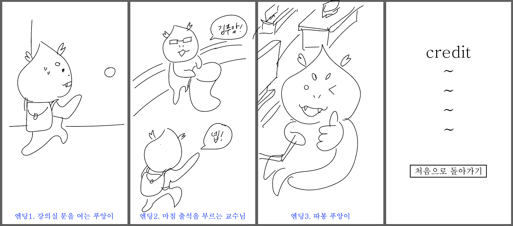

# T04
커밋 1000번 찍읍시다!

## 기능 목록
- 화면모드 전환
  : (1)시작화면, (2)인트로, (3)*3 라운드 1~3(각각 시작화면, 게임 실행, 게임 실패 엔딩), (4)아웃트로, (5)크레딧 -> 총 13개의 화면모드
  - 시작화면 메뉴 : <게임시작>, <크레딧> 2가지 버튼 클릭시 해당 화면 모드로 전환되기
  - 인트로, 아웃트로에서 화면 클릭/키보드 입력시 다음 장면으로 넘어가기
  - 각 라운드 실패 엔딩 화면 : <게임 다시 하기>, <처음으로 돌아가기> 2가지 버튼 클릭시 해당 화면 모드로 전환되기
  - 크레딧 화면 : <처음으로 돌아가기> 버튼 구현
  - 인트로 건너뛰기 버튼.. 제작할 수도 있음

- 게임 실행 화면 상단
  - 게임 진행 상황 게이지와 게임 내의 시계 구현을 위한 time()세팅
  - 게임 진행 정도에 따라서 게임 실행 화면 상단에서 도형 이동
  - 게임 진행 정도에 따라서 게임 실행 화면 상단의 시계의 시간 변화
- 게임 시간 제한 : 각 라운드별로 60초 예정

- 메인 게임 기능
  - 캐릭터 클래스
    - 키보드 입력 받아 캐릭터 좌우 이동
    - 캐릭터가 화면 밖으로까지 이동하지 않도록 캐릭터 이동 범위 설정
    - 캐릭터와 장애물 충돌 감지
  - 장애물 클래스
    - 장애물이 위에서 아래로 이동
    - 장애물이 화면 아래로 내려가서 화면에서 보이지 않게 되면 인스턴스 삭제하기
    - 장애물 랜덤 생성
    - 장애물 생성 속도, 생성 위치 적절하게 조절해줄 필요 있음
    - 각 라운드 올라갈 때마다 장애물 내려오는 속도가 조금씩 빨라져야 함
  - 각 라운드 별로 화면 세팅하는 클래스
    - 게임 진행 상황 게이지 표시
    - 게임 내 시계 표시
    - 라운드별 배경화면 설정
    - 라운드별 배경음악 설정

